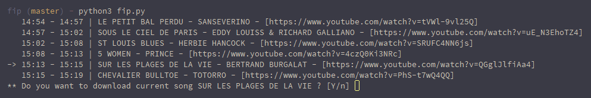

# fip
Display and download songs playing live on [FIP](https://www.fipradio.fr/player) radio.

## Dependencies
`python3` to display and [youtube-dl](https://rg3.github.io/youtube-dl/) to download.

## Usage
`python3 fip.py`

